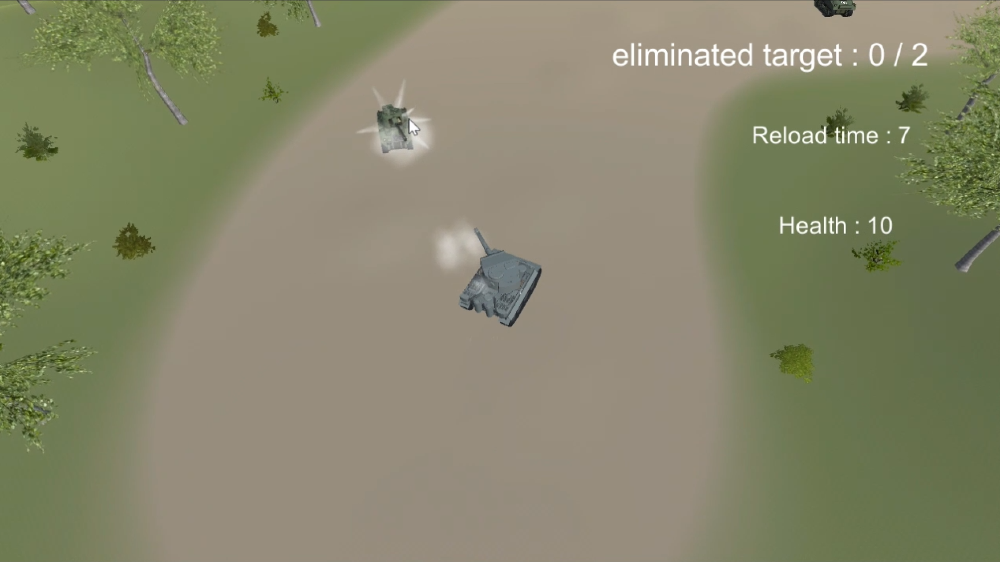
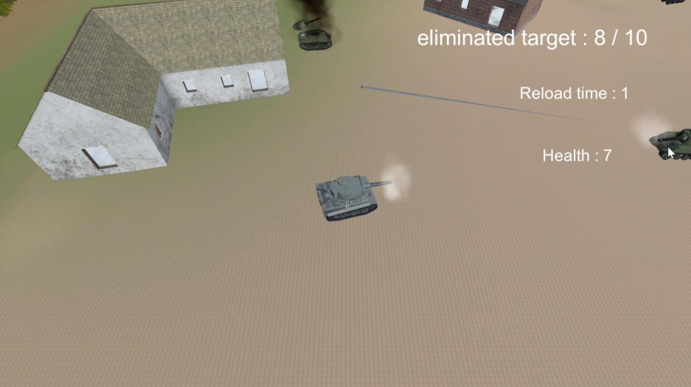
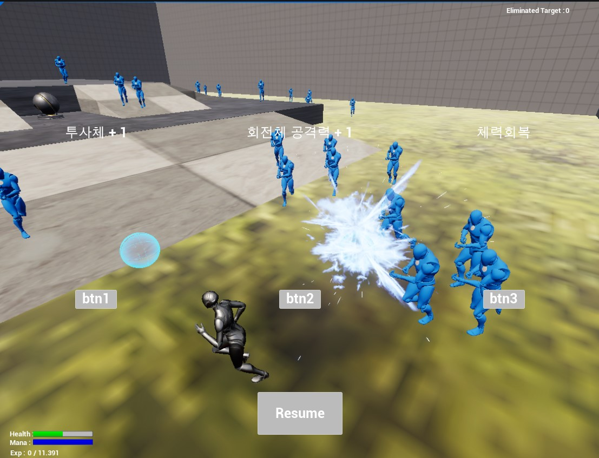
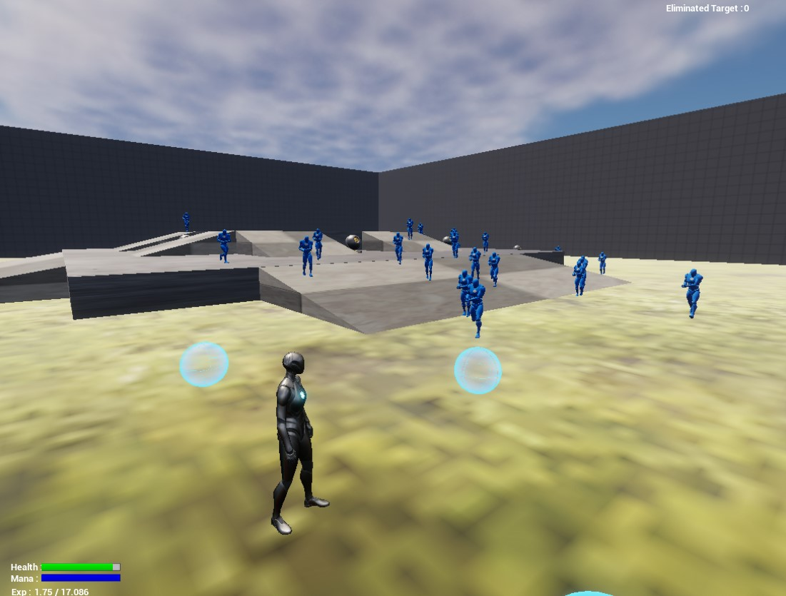
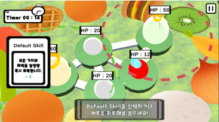
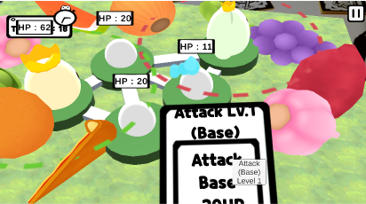
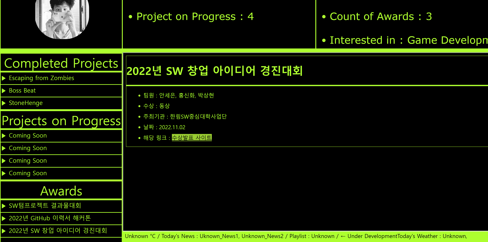
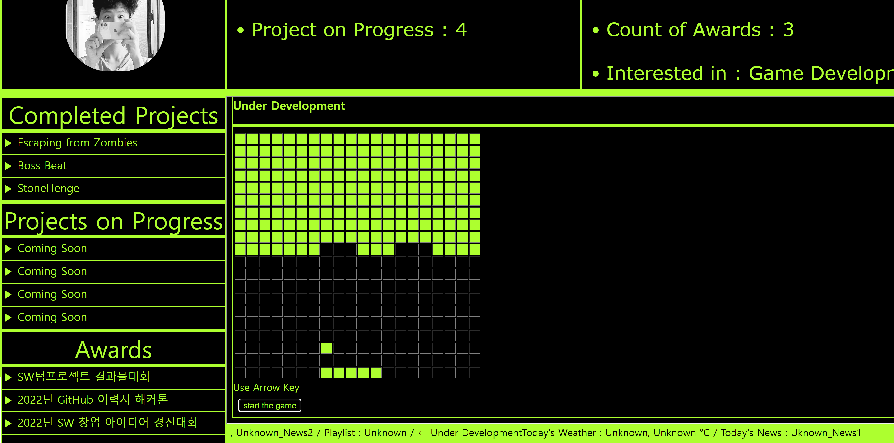

# Hello World!

## 1. Introdution
---
- Name : Park Sanghyeon (박상현)
- Age : 26
- Email : aice7@naver.com

- Major : 빅데이터전공
  - 학과 소개
    ```
    빅데이터 활용 능력을 통해 미래를 만들어 갈 수 있는 인력을 배양하는데 목표를 두고 있으며,
    수준 높은 소프트웨어 개발자로 사회에 기여할 수 있도록 해주는 학과
    ```
    🖥️<u>[more](https://www.hallym.ac.kr/hallym_univ/sub01/cP14/sCP11.html)</u> 
 
- Dual Major : 콘텐츠IT전공
  - 학과 소개
    ```
    콘텐츠IT 분야의 전문인력 양성을 목표로 VR/AR 트랙과 게임 개발자 트랙으로 구분하여,
    학업을 체계적으로 이수할 수 있도록 도움을 주는 학과
    ```
    🎮<u>[more](https://www.hallym.ac.kr/hallym_univ/sub01/cP14/sCP12.html)</u> 

- Languages I studied
  - JAVA
  - C
  - C++
  - Python
  - C#(Unity)
  - HTML, CSS, Javascript, Jquery
- What I want to learn now is..
  - `Linux`[^1], `Unreal Engine`[^2], `Unity .. more deeply`[^3], `Managing Server of Minecraft`[^4]

---
## List of Projects
###### [Project Name Link] (used engine, solo or team)

- [Surviving from Zombies](#2-1-surviving-from-zombies) [:memo:](#info, "Unity Engine, Trio")

- [Boss Beat](#2-2-boss-beat) [:memo:](#info, "Unity Engine, Solo")

- [Stone Henge](#2-3-stone-henge) [:memo:](#info, "WebGL, Solo")

- [Project Tank](#2-4-project-tank) [:memo:](#info, "Unity Engine, Solo")

- [Altar](#2-5-altar) [:memo:](#info, "Unity Engine 5.0, Solo")

- [SlimeAttack](#2-6-slimeattack) [:memo:](#info, "Unity Engine, Vuforia, Duo")

- [2022 My Blog](#2-7-2022-my-blog) [:memo:](#info, "HTML, CSS, Jquery, Javascript, Solo")


---

## 2. Projects
### 2-1 Surviving from Zombies
> 팀으로 진행한 텀프로젝트 / 3인이서 개발, 유니티 엔진을 사용
- 프로젝트 설명
  ```
  바이러스에 감염된 좀비들이 넘치는 도시에서 백신을 모아 탈출하는 1인칭 슈팅게임
  ```
- 조작키 및 구현내용 설명
  | **조작키** | **구현내용** |
  |------|---------------|
  | WASD | 플레이어 움직임 컨트롤 |
  | WASD + Left Shift | 플레이어 달리기 |
  | 마우스 이동 | 플레이어 시선 컨트롤 |
  | 마우스 왼쪽 버튼 | 총 발사 |
  | 마우스 오른쪽 버튼 클릭 유지 | 견착 사격 |
  | Space bar | 플레이어 점프 |
  | R | 장전 |
  | T | 총 둘러보기 |
  | E | 총 들기 / 집어넣기 |
  | F | 칼 공격1 |
  | Q | 칼 공격2 |
  
- 개인적으로 담당한 부분
  - 근접공격 구현
  - 좀비(적) 모델링을 제외한 것들을 구현
  - 게임 오버 화면 구현
  - <u>[__상세정보__](https://github.com/Park132/Github_portpolio/blob/407a85e219a71fdf07bfd6cecc65125f1904de58/2_1SZ/Surviving%20from%20Zombies%20%EA%B0%9C%EC%9D%B8%20%EA%B8%B0%EB%8A%A5%20%EA%B5%AC%ED%98%84%20%EC%A0%95%EB%A6%AC.docx)</u> 
  
- 프로젝트 결과

  
  
  

- 프로젝트를 진행하면서 느낀 점
  - 어려웠던 점
    
    **`1. 팀원과의 소통 부족`** ⬅️
      서로간의 소통이 부족하여 계획에 차질이 생김
      
    **`2. 서로의 작업물을 병합하기`** ⬅️
      서로의 작업물을 이해하지 못해 합칠 때 어려움을 겪음

    **`3. 구체적이지 않은 계획`** ⬅️
      구체적이지 않아 프로젝트의 진행상황을 파악하지 못함
    
  - 깨달은 점
    ```
    1. 팀원과 적극적인 소통을 하여, 진행하는 프로젝트를 이해해야함
    2. 서로 코드를 주고받을 때 주석을 통해 상대방이 이해하기 쉽게 해야함
    3. 계획의 구체화(분석, 설계, 구현, 디버그)가 필요
    ```
    
---
### 2-2 Boss Beat
> 개인이 진행한 텀 프로젝트 / 유니티 엔진을 사용하여 VR 게임을 제작함
- 프로젝트 설명
  ```
  보스의 공격을 피하며 총으로 보스를 공격하는 1인칭 슈팅 게임
  총으로 공격시 좌측아래 원의 타이밍에 맞춰 총을 발사하면 총알 데미지에 보너스를 줌
  ```
- 조작키 및 구현 내용
  | **조작키** | **구현내용** |
  |------|---------------|
  | 머리를 좌우로 기울임 | 부채꼴 호의 경로를 따라 좌우로 움직임 |
  | 카드보드의 터치 | 해당 기능을 통해 총 발사 |
  
- 담당한 부분
  - 모델링 사운드를 제외한 모든 것들을 담당함
  - <u>[__상세정보__](https://github.com/Park132/Github_portpolio/blob/main/3_1BB/%ED%8F%AC%ED%8A%B8%ED%8F%B4%EB%A6%AC%EC%98%A4%203%ED%95%99%EB%85%84%20BB.docx)</u>
- 프로젝트 결과

  
  
  

- 프로젝트를 진행하면서 느낀 점
  - 어려웠던 점
    
    **`1. 기량이 정체된 것을 느낌`** ⬅️
      강의에서 배운 내용을 최대한 활용하려 했지만, 기대보다 결과가 안좋았음
      
    **`2. 혼자서 감당해야하는 작업량`** ⬅️
      이번 개인 프로젝트를 진행하며, 혼자서 모든 업무를 담당하는 것이 얼마나 시간이 많이 걸리고 힘든지 알게됨

  - 깨달은 점
    ```
    1. 현재 수준에서 만족하는 것이 아니라, 인터넷을 찾아보던가 다른 활동에 참여하면서 게임 개발 기량을 늘려야함
    2. 혼자서 모든 것을 해보는 것은 좋은 경험이긴 하지만, 기회가 된다면 팀과 함께 프로젝트를 진행하면서 소통능력과 협업능력을 늘려야함
    ```
  - 새롭게 알게 된 점
    ```cs
    if (nodeTimer >= 60.0d / stdBPM)
    {
      nodeTImer -= 60.0d / stdBPM; // 0.01005의 시간만큼 오차가 생성되므로 빼줘야함
    }
    ```
    - 유니티 엔진의 특성상 매번 일정한 시간에 맞춰 시간을 초기화 할 때마다 작은 오차가 발생함
    - 그 오차시간을 구한 다음 빼줌으로서 오차를 없애줌
  
---
### 2-3 Stone Henge
> 개인이 진행한 텀 프로젝트 / WebGL을 사용하여 
- 프로젝트 설명
```
플레이어가 고민 중일 때 이 게임을 켜서 제단과 상호작용을하면
신성한 게임이펙트 효과와 텍스트로 랜덤한 대답이 나오는 미니 게임
스톤헨지를 만드는 것에 시간이 너무 소비되어 후자의 기능들은 구현하지 못함
```
- 조작키
  | **조작키** | **구현내용** |
  |------|---------------|
  | 화살표(마우스로 클릭) | 카메라 이동 |
  | 화면을 마우스로 드래그 | 시점 변경 |
  
- 담당한 부분
  - WebGL을 통하여 스톤헨지를 구현
  - <u>[__상세정보__](https://github.com/Park132/Github_portpolio/blob/819d8c97a001d9db3e5b01479d77c43f6370fc80/3_1SH/%EB%B0%9C%ED%91%9Cppt_20175411.pptx)

- 프로젝트 결과
  
  
  
  
  
- 프로젝트를 진행하면서 느낀 점
  - 어려웠던 점
    
    **`1. 어렴풋이 생각만 했던 개발 방식`** ⬅️
      스톤헨지에서 거대한 돌 하나를 만드는 것 조차, 3차원의 벡터를 설정하면서 위치를 지정했는데, 이 과정들이 너무 생소해서 적응하는데 시간이 많이 걸림
      
    **`2. 3차원 공간 계산`** ⬅️
      유니티의 경우 게임 씬에 Cube를 놓고 드래그로 위치 조정을 했던 것들이, WebGL에서는 원하는 위치를 알맞게 계산해서 코드로 위치를 지정해야했음. 이 과정에 시간이 너무 소모되어 나머지 기능들을 구현할 시간이 너무 부족했음

  - 깨달은 점
    ```
    1. 간단히 사용만 하던 게임 개발 툴 뒤엔 어떻게 작동하는지에 대한 원리를 알음
    2. 해당 강의를 수강하면서 __게임 클라이언트 개발자__라는 직군에 대해 알게됨
    ``` 
    
---
### 2-4 Project Tank
> 개인이 진행한 텀 프로젝트 / 유니티를 사용하여 - 2021.3.8f1
- 프로젝트 설명
```
탑뷰 형식으로 게임이 진행됨.
플레이어의 전차를 이용하여 게임 진행, 적 2명을 사살시 레벨업을 하여 
재장전 속도 감소, 도탄 확률 상승, 이동속도 상승 중 한가지를 골라 강화
보다 강해진 탱크로 적 탱크들을 모두 파괴하는 것이 게임의 목표
```
- 해당 리포지토리 링크
  - :bomb:<u>[__Link__](https://github.com/Park132/git-3d.git)
- 조작키
  | **조작키** | **구현내용** |
  |------|---------------|
  | W, S | 전차 전진 및 후진 |
  | A, D | 전차 좌, 우 회전 |
  | 마우스 이동 | 포탑이 바라보는 방향 조작 |
  | 마우스 왼쪽 클릭 | 포탄 발사 |
  
- 담당한 부분
  - 모델링, 사운드를 제외한 모든 것을 담당 (유니티 사용)
  - 관련 ppt 자료 ▶ <u>[__상세정보__](https://docs.google.com/presentation/d/1d_4RX0IqOk1hL1UCklkmTcDFKe9w8Zun/edit?usp=sharing&ouid=107613512527669999751&rtpof=true&sd=true)

- 프로젝트 결과
  
  
  
  
  
- 프로젝트를 진행하면서 느낀 점
  - 어려웠던 점
    
    **`1. 포탑의 발사위치 지정`** ⬅️
      ScreenPointToRay 함수를 통해 포탑이 마우스가 있는 지점을 3차원으로 바라보게 했습니다. 그리고 포탑이 바라보는 과정은 실제 포탑의 구동원리대로 움직이게 하려 했지만, 구현해내지 못했습니다. <u>결국 포신이 따로 움직이는 것이 아니라 포탑 자체가 움직이게 되었는데, 이는 맵의 울퉁불퉁한 부분을 최소화 하면서 감추게 했습니다.</u>
      
    **`2. 탱크 이동의 물리 적용`** ⬅️
      탱크의 이동은 transform.Translate함수로 구성했습니다. 그리고 Rigidbody를 적용했습니다. 이렇게 했더니 탱크가 심하게 기울어졌을 때, 땅을 뚫거나 하늘로 날아가는 현상이 발생했습니다. 이는 AddForce를 통해 고칠 수 있었지만, 당시 시간이 촉박하여 <u>조작관련 스크립트를 수정하는 것이 아니라 유니티 엔진에서 Rigidbody의 질량값을 크게 늘려 해결했습니다.</u>
  
    **`3. 빌드시 UI가 적용 안됨`** ⬅️
      빌드 시 UI가 게임에 적용이 안되는 문제가 발생했습니다. 이에 관해서 해상도, Canvas, 여러가지를 다 손데어보고 교수님께도 도움을 요청했지만, 고치지 못하였습니다. 

  <details>
  <summary>개발기록</summary>
    
    > 1일차
    >> 리포지토리 생성, 필요파일 임포트, 플레이어 모델에 콜라이더 설정
    
    > 2일차
    >> 포탑구현, 발사구현, 카메라 고정구현, 적 탱크 유폭현상 구현
    
    > 3일차
    >> 플레이어 이동시 효과 구현, 포탑이동 구현, 맵 구현
    
    > 4일차
    >> 환경관련 패키지 임포트
    
    > 5일차
    >> 적 네비메쉬, 적 행동패턴구현
    
    > 6일차
    >> 적군 행동패턴 수정
    
    > 7일차
    >> 오류수정
    
    > 8일차
    >> 소리넣기 및 오류수정, 빌드시 ui관련 문제 발생
    
    > 9일차
    >> 오류수정
    
    > 10일차
    >> 오류수정
    
    > 11일차
    >> 사운드 수정
    
    > 12일차
    >> 플레이어가 죽을 때, 메인화면 이동 구현
   
  </details>

---
### 2-5 Altar
> 개인이 진행한 텀 프로젝트 / Unreal Engine 5.0
- 프로젝트 설명
```
3인칭 형식으로 게임이 진행되며, 키보드와 마우스 클릭으로 게임이 진행됨
무한히 쏟아져 나오는 적을 죽이면서 경험치를 얻고 레벨업을 함
레벨업을 할 때 무작위로 나오는 강화옵션들 중 한가지를 선택하여 캐릭터를 강화
최대한 오래 살아남는 것이 게임의 목표
```
- 해당 리포지토리 링크
  - :runner:<u>[__Link__](https://github.com/Park132/git-ue.git)
- 조작키
  | **조작키** | **구현내용** |
  |------|---------------|
  | W, A, S, D | 캐릭터 이동 |
  | 마우스 이동 | 캐릭터 카메라 이동 |
  | 마우스 왼쪽 클릭 | 포탄 발사 |
  
- 담당한 부분
  - 모델링, 사운드를 제외한 모든 것을 담당 (언리얼 엔진을 사용)
  - 관련 ppt 자료 ▶ <u>[__상세정보__](https://docs.google.com/presentation/d/1xPhkpx0rlORSRPK5ICzjzZW4zk7a5H93/edit?usp=sharing&ouid=107613512527669999751&rtpof=true&sd=true)

- 프로젝트 결과
  
  
  
  
  
- 프로젝트를 진행하면서 느낀 점
  - 어려웠던 점
    
    **`1. 언리얼엔진의 비쥬얼 스크립트`** ⬅️
      처음 경험해보는 코드 기법이었습니다. 모든 것이 생소했지만, <u>점차 익숙해졌고 잘 적응해나갔습니다.</u>
      
    **`2. 언리얼엔진의 C++`** ⬅️
      C++을 통해 Component같은 것들이나 함수들을 만들어보고 싶었습니다. 하지만 그 과정들은 이해하기 어려웠고, 빌드 오류가 잦아 만들던 작업물을 전부 잃기도 했습니다. <u>이런 문제들은 저장 기능을 생활화하여 어느정도 극복할 수 있었지만, 능숙해지기 위해서는 다소 시간이 걸릴 듯 합니다.</u>
  

  <details>
  <summary>개발기록</summary>
    
    > 1일차
    >> 프로젝트 생성, 기본적인 맵 제작
    
    > 2일차
    >> 맵 수정, 카메라 위치 수정, 투사체 발사 및 피격 기능 구현
    
    > 3일차
    >> 저장 기능 구현 시작, 적 인공지능 구현, 발사체 효과 구현, ui 구현
    
    > 4일차
    >> 레벨업 기능 구현 시작, 저장 기능 구현 보류
    
    > 5일차
    >> 경험치 바 변경, 레벨업시 화면에 표시할 UI와 선택사항들 구상
    
    > 6일차
    >> 강화기능 6가지 구상, 기본공격 속도, 공격력 함수로 조절 가능하게 만들어둠
    
    > 7일차
    >> 강화기능(3/6) 구현, 체력회복팩 기능 구현
    
    > 8일차
    >> 강화기능(3/6) 구현, 체력회복팩 맵에 자동 생성하게 만듬
    
    > 9일차
    >> 강화기능(5/6) 구현, 자동발사 포탑에 공격쿨타임을 변수로 조절하게함
    
    > 10일차
    >> 강화기능 전부 구현, 레벨업 기능구현
    
    > 11일차
    >> 레벨업, 랜덤옵션 선택 기능 기능 구현
    
    > 12일차
    >> 일시정지 구현, 종료 및 계속하기 구현
   
  </details>

---
### 2-6 SlimeAttack
> 팀으로 진행한 텀 프로젝트 / Unity & Vuforia (2인 개발)
- 프로젝트 설명
```
증강현실을 게임으로, Vuforia를 이용하였고, 스마트폰을 통해 게임을 할 수 있습니다.
플레이어의 시작지점이 될 플레이어 마커와 적이 생성될 적 마커
그리고 중간지점을 생성해줄 중간 마커로 총 3 종류의 마커를 이용하여 게임을 진행합니다.
이외에 스킬카드를 인식시키고 터치를 통해 사용하면서 게임 진행을 유리하게 이끕니다.
플레이어 거점으로부터 중간마커와 적 마커를 점령하여 게임에서 승리하는 것이 목표입니다.
```
- 해당 리포지토리 링크
  - :chestnut:<u>[__Link__](https://github.com/Park132/git-ar.git)
  
- 조작 기능
  | **조작키** | **구현내용** |
  |------|---------------|
  | 스마트폰 카메라 | 게임화면 출력 |
  | 화면 터치 | 거점 클릭, 스킬 사용 |
  
- 담당한 부분
  - 관련 ppt 자료 ▶ <u>[__상세정보__](https://docs.google.com/presentation/d/1lmo4ADlvTBv8ttFLliyMBjV6eHRBcoml/edit?usp=sharing&ouid=107613512527669999751&rtpof=true&sd=true) ◀ **확인 강추!**:wink:
  - 해당 프로젝트는 팀으로 진행하였습니다
  - 
    > PSH
    >> 게임기획<br>
    >> UI아이디어 구상<br>
    >> 스킬 구상 및 구현<br>
    >> 맵 디자인<br>
    >> 이펙트 선정
  
    > LSM
    >> 게임 기본틀 제작<br>
    >> 마커 UI 제작<br>
    >> 적 인공지능 제작<br>
  
  - 프로젝트를 진행하는 것에 있어, 구글 스프레드시트를 통해 작업 진행, 일정을 관리하였습니다.
  :date:<u>[__구글 스프레드시트__](https://docs.google.com/spreadsheets/d/1XJCN02PJmefbUTiuzGeqIgXhyr6QQCsxy7IfTOkqtOg/edit?usp=sharing)

- 프로젝트 결과
  
  
  
  
  
- 프로젝트를 진행하면서 느낀 점
  - 어려웠던 점
    
    **`1. Vuforia Engine을 이용한 첫 번째 증강현실 게임 구현`** ⬅️
      웹캠을 통해, 카메라로 증강현실로 물체를 띄우고 서로 상호작용을 시켜 게임을 만들어가는 과정은 역시 생소했지만, 교수님의 수업과 수업자료들을 통해 극복해나갈 수 있었습니다.
      
    **`2. 아직 미숙한 Github사용`** ⬅️
      이 프로젝트는 팀으로 진행되었고, 전 이 프로젝트에서 과거의 경험을 최대한 살렸습니다. 그리고 Unity package를 import해서 작업물을 공유하는 것이 아니라 Github Desktop을 통하여 작업물을 공유하였습니다. 공유하는 과정은 훨씬 편해졌지만, 동시간대에 작업하는 경우, 한 쪽의 작업물이 소실되는 경우가 2, 3번 있었습니다. 이 경우 revert changes in commit기능도 제대로 먹히지 않아서 난항을 겪었지만, 따로 백업파일을 두는 것을 습관화 하여 프로젝트를 마무리할 수 있었습니다.

---
### 2-7 2022 My Blog
> 개인이 진행한 프로젝트 / Web
- 프로젝트 설명
```
웹 프로젝트로, "2022년 나의 블로그"를 주제로 만든 웹페이지입니다.
2가지 탭에서는 이때까지 완료한 프로젝트의 개요와 수상 내역을 기재하였습니다.
**coming soon**탭에서는 Jquery와 html의 테이블 기능을 이용하여 벽돌부수기 게임을 만들었습니다.
```
- 해당 리포지토리 링크
  - :memo:<u>[__Link__](https://github.com/Park132/git-web.git)
  
- 담당한 부분
  - 관련 ppt 자료 ▶ <u>[__상세정보__](https://docs.google.com/presentation/d/1lmzsk8Ytjke5XBjqC2LvmU--X4Mxb_y8/edit?usp=sharing&ouid=107613512527669999751&rtpof=true&sd=true) 
  - 이 프로젝트는 혼자서 진행했습니다.
  
- 프로젝트 결과
  
  
  <hr>
  
  
- 프로젝트를 진행하면서 느낀 점
  - 어려웠던 점
    
    **`1. HTML, CSS, Jquery`** ⬅️
      유니티만 다루다 웹 프로그래밍을 처음 다뤘기에 쉽게 적응되지 않았습니다. 하지만 깃허브에 포트폴리오를 정리했던 경험 덕분에 수업 진도를 빠르게 따라잡을 수 있었습니다. 공부가 심화되면서, CSS, Javascript, Jquery도 적응하는데엔 큰 문제가 없었습니다. 그러나 프로젝트를 진행할 때 웹 폼을 어떻게 나눠야하는지부터 원하는 디자인이나 모양, 기능들이 제대로 구현되지않아 만족스럽지 못했습니다. 이런 점들을 극복하기 위해서는 말 그대로 많이 해보는 방법만 있는 것 같습니다.
  
  <details>
  <summary>개발기록</summary>
    
    > 1일차
    >> 초기 파일 생성, 화면 디자인, 왼쪽 위젯에 슬라이더 기능 추가<br>jquery를 이용하여 시스템 동작 추가
    
    > 2일차
    >> 파일 다운로드 구현기능 시작
    
    > 3일차
    >> 위치를 재조정하여 footer에 상태표시가 되게 함
    
    > 4일차
    >> coming soon에 등장할 게임 구현 시작
    
    > 5일차
    >> 오류 및 코드 수정
    
  </details>

---
### 2-8 Descent
> 팀으로 진행한 텀 프로젝트 / Unity & Photon & Unity Machine Learning (3인 개발)
- 프로젝트 설명
```
팀으로 진행된 AOS장르의 멀티플레이 게임입니다.
포톤을 이용하여 멀티플레이 기능을 구현하였고, Unity Machine Learning을 이용하여 인공지능을 게임에 넣었습니다.
각 공격로로 미니언을 보내는 비율을 정할 수 있습니다.
그리고 게임의 가장 큰 특징으로 플레이어는 탑뷰에서 전장 상황을 확인 후,
미니언에게 빙의하여 1인칭 시점에서 게임을 플레이 할 수 있습니다.
(이 경우 플레이어는 추가적인 능력치와 액티브 스킬들을 갖게 됩니다.)
최종적으로 상대팀의 베이스를 파괴하여 게임에서 승리합니다.
```
- 해당 리포지토리 링크
  - :skull:<u>[__Link__](https://github.com/Park132/git-ar.git) ◀ 멀티플레이만 구현되었으므로 혼자서 플레이 :x:
  
- 조작 기능
  | **조작키** | **구현내용** |
  |------|---------------|
  | W, A, S, D | 탑뷰시점에서 카메라 이동 |
  || 1인칭에서 캐릭터 이동 |
  | 마우스 왼쪽 클릭 | 미니언 클릭 |
  || 1인칭에서 캐릭터 기본 공격 |
  |Q, E| 1인칭 시점에서 스킬 사용 |
  
- 담당한 부분
  - 관련 ppt 자료 ▶ <u>[__상세정보__](https://drive.google.com/file/d/1qMiXpnTqVY6yEKFpnhBcc_K5Dg6Z7HdR/view?usp=sharing) ◀ **확인 강추!**:wink:
  - 해당 프로젝트는 팀으로 진행하였습니다
  - 
    > PSH
    >> 게임기획<br>
    >> 프로토타입 캐릭터 개발 및 구체화<br>
    >> Photon R&D<br>
    >> 게임 맵 디자인<br>
    >> 캐릭터 선택 화면 디자인<br>
    >> 사운드 선정<br>
  
    > LSM
    >> 프로토타입 개발<br>
    >> 디테일 보충<br>
    >> 예외처리<br>
    >> UI디자인 기획 및 구현<br>
    >> 전사 스킬 및 이펙트 상향수정<br>

    > HSH
    >> 미니언 기획 및 구현<br>
    >> Unity Machine Learning R&D<br>
    >> 인공지능 적용 모델 기획 및 구현<br>
    >> 디버깅, QA업무<br>
  
  - 프로젝트를 진행하는 것에 있어, 구글 스프레드시트를 통해 작업 진행, 일정을 관리하였습니다.
  :date:<u>[__구글 스프레드시트__](https://docs.google.com/spreadsheets/d/1Qzv0TRTo73e4JdQ92Amah9FKGUQW6xlH6JYoMIjau6k/edit#gid=0)

- 프로젝트 결과
  - 시연동영상 ▶<u>[🎮](https://drive.google.com/file/d/1wIdhO1_iUqqzGrSamw0ilS7mxVgZ7tDB/view?usp=sharing)

  

  
  
  
  
- 프로젝트를 진행하면서 느낀 점
  - 어려웠던 점
    
    **`1. Vuforia Engine을 이용한 첫 번째 증강현실 게임 구현`** ⬅️
      웹캠을 통해, 카메라로 증강현실로 물체를 띄우고 서로 상호작용을 시켜 게임을 만들어가는 과정은 역시 생소했지만, 교수님의 수업과 수업자료들을 통해 극복해나갈 수 있었습니다.
      
    **`2. 아직 미숙한 Github사용`** ⬅️
      이 프로젝트는 팀으로 진행되었고, 전 이 프로젝트에서 과거의 경험을 최대한 살렸습니다. 그리고 Unity package를 import해서 작업물을 공유하는 것이 아니라 Github Desktop을 통하여 작업물을 공유하였습니다. 공유하는 과정은 훨씬 편해졌지만, 동시간대에 작업하는 경우, 한 쪽의 작업물이 소실되는 경우가 2, 3번 있었습니다. 이 경우 revert changes in commit기능도 제대로 먹히지 않아서 난항을 겪었지만, 따로 백업파일을 두는 것을 습관화 하여 프로젝트를 마무리할 수 있었습니다.

  

## 3. Plan
1. __`정보처리기사 자격증`__ 취득!
2. __`모바일 게임`__ 을 빌드하여 구글 플레이스토어에 업로드
3. ~~복학 전까지 전공 공부 미리 해놓기~~
---
  


###### 주석

[^1]: 인터넷 및 네트워크를 쓰는 대부분의 장비들은 리눅스를 채택하고 있는 것으로 알고 있습니다. 그런만큼 리눅스를 한 번 다뤄보고 익히고 싶습니다.

[^2]: 휴학계 1년 중 8개월을 게임회사에서 일하면서 여러 이야기를 접했는데, 인디게임회사 쪽에서는 주로 유니티를, 이외의 게임회사들은 언리얼 엔진을 사용하거나 자체적으로 개발한 엔진을 사용하고 있다는 것을 알게 되었습니다. 그래서 저는 취업하거나 창업할 때 제 기량을 유니티에만 국한되지 않고 다양한 엔진을 활용하고자 언리얼엔진을 공부할 계획입니다.

[^3]: 콘텐츠IT과에서 여러 강의를 들으면서 유니티를 이용해 게임을 2개 개발한 이력이 있지만, 게임의 기능구현 수준이 더이상 발전하지 못하고 있다고 느끼고 있습니다. 그래서 유니티를 좀 더 공부하고 게임들을 개발하면서 지금 보다 더 나은 수준의 게임들을 만들고 싶습니다.

[^4]: 지금까지의 게임 중 멀티플레이 요소가 들어간 게임을 만든 적이 없습니다. 그래서 기회가 된다면 개인들이 운영하는 마인크래프트 서버팀에 들어가 서버 관리 및 보수일을 체험하고 배워보고 싶습니다.


