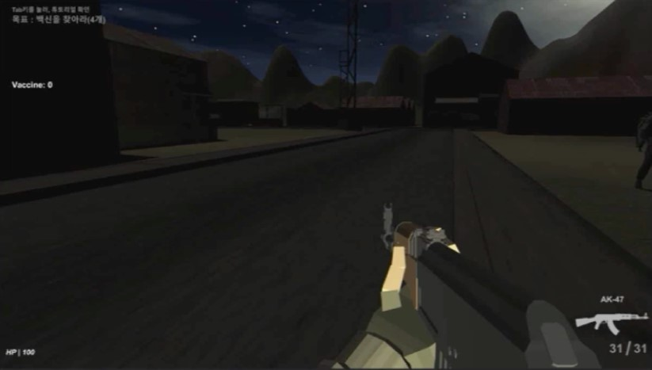

# Hello World!

## 1. Introdution
---
- Name : Park Sanghyeon (박상현)
- Age : 25
- Email : aice7@naver.com

- Major : 빅데이터전공
  - 학과 소개
    ```
    빅데이터 활용 능력을 통해 미래를 만들어 갈 수 있는 인력을 배양하는데 목표를 두고 있으며,
    수준 높은 소프트웨어 개발자로 사회에 기여할 수 있도록 해주는 학과
    ```
    🖥️<u>[more](https://www.hallym.ac.kr/hallym_univ/sub01/cP14/sCP11.html)</u> 
 
- Dual Major : 콘텐츠IT전공
  - 학과 소개
    ```
    콘텐츠IT 분야의 전문인력 양성을 목표로 VR/AR 트랙과 게임 개발자 트랙으로 구분하여,
    학업을 체계적으로 이수할 수 있도록 도움을 주는 학과
    ```
    🎮<u>[more](https://www.hallym.ac.kr/hallym_univ/sub01/cP14/sCP12.html)</u> 

- Languages I studied
  - JAVA
  - C
  - C++
  - Python
- What I want to learn now is..
  - `Linux`[^1], `Unreal Engine`[^2], `Unity .. more deeply`[^3], `Managing Server of Minecraft`[^4]


---

## 2. Projects
### 2-1 Surviving from Zombies
> 팀으로 진행한 텀프로젝트 / 3인이서 개발, 유니티 엔진을 사용
- 프로젝트 설명
  ```
  바이러스에 감염된 좀비들이 넘치는 도시에서 백신을 모아 탈출하는 1인칭 슈팅게임
  ```
- 조작키 및 구현내용 설명
  | **조작키** | **구현내용** |
  |------|---------------|
  | WASD | 플레이어 움직임 컨트롤 |
  | WASD + Left Shift | 플레이어 달리기 |
  | 마우스 이동 | 플레이어 시선 컨트롤 |
  | 마우스 왼쪽 버튼 | 총 발사 |
  | 마우스 오른쪽 버튼 클릭 유지 | 견착 사격 |
  | Space bar | 플레이어 점프 |
  | R | 장전 |
  | T | 총 둘러보기 |
  | E | 총 들기 / 집어넣기 |
  | F | 칼 공격1 |
  | Q | 칼 공격2 |

- 프로젝트 결과




  


###### 주석

[^1]: 인터넷 및 네트워크를 쓰는 대부분의 장비들은 리눅스를 채택하고 있는 것으로 알고 있습니다. 그런만큼 리눅스를 한 번 다뤄보고 익히고 싶습니다.

[^2]: 휴학계 1년 중 8개월을 게임회사에서 일하면서 여러 이야기를 접했는데, 인디게임회사 쪽에서는 주로 유니티를, 이외의 게임회사들은 언리얼 엔진을 사용하거나 자체적으로 개발한 엔진을 사용하고 있다는 것을 알게 되었습니다. 그래서 저는 취업하거나 창업할 때 제 기량을 유니티에만 국한되지 않고 다양한 엔진을 활용하고자 언리얼엔진을 공부할 계획입니다.

[^3]: 콘텐츠IT과에서 여러 강의를 들으면서 유니티를 이용해 게임을 2개 개발한 이력이 있지만, 게임의 기능구현 수준이 더이상 발전하지 못하고 있다고 느끼고 있습니다. 그래서 유니티를 좀 더 공부하고 게임들을 개발하면서 지금 보다 더 나은 수준의 게임들을 만들고 싶습니다.

[^4]: 지금까지의 게임 중 멀티플레이 요소가 들어간 게임을 만든 적이 없습니다. 그래서 기회가 된다면 개인들이 운영하는 마인크래프트 서버팀에 들어가 서버 관리 및 보수일을 체험하고 배워보고 싶습니다.


